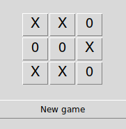

# Tic-Tac-Toe 

*Tic-Tac-Toe game with Tkinter frontend and numpy backend*

* GUI based on Tkinter
* The game logic was implemented using numpy matrices
* Switching moves was implemented using the itertools.cycle() function

